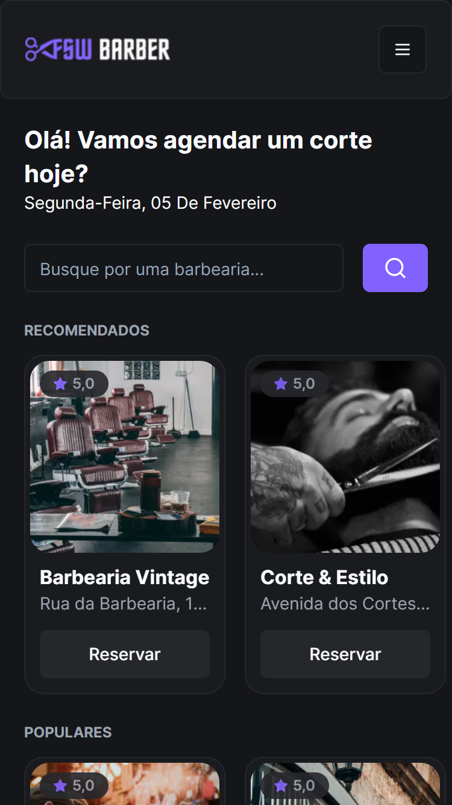
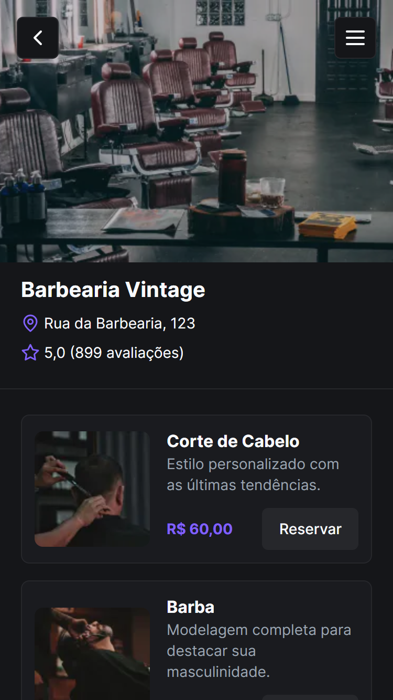

<h1 align="center">FSW Barber</h1>

  <a href="#tecnologias">Tecnologias</a>&nbsp;&nbsp;&nbsp;|&nbsp;&nbsp;&nbsp;
  <a href="#projeto">Projeto</a>&nbsp;&nbsp;&nbsp;|&nbsp;&nbsp;&nbsp;
  <a href="#licenca">Licença</a>

  

  
  

## 🛠 Tecnologias

Esse projeto foi desenvolvido com as seguintes tecnologias:

- React
- Next.js
- Tailwind CSS
- Shadcn/UI
- Node.js
- Prisma
- Next Auth
- PostgreSQL

## 💻 Projeto

O FSW Barber é um sistema de barbearia na qual é possivel fazer login com o Google, buscar uma barbearia, fazer uma reserva e cancelar a mesma.

- [Acesse o projeto finalizado, online](https:/fsw-barber-pedroeuzebio.vercel.app)

## 📝 Licença

Esse projeto está sob licença MIT. Veja o arquivo [LICENÇA](LICENSE.md) para mais detalhes.

---

Feito com ♥ by Pedro Euzebio